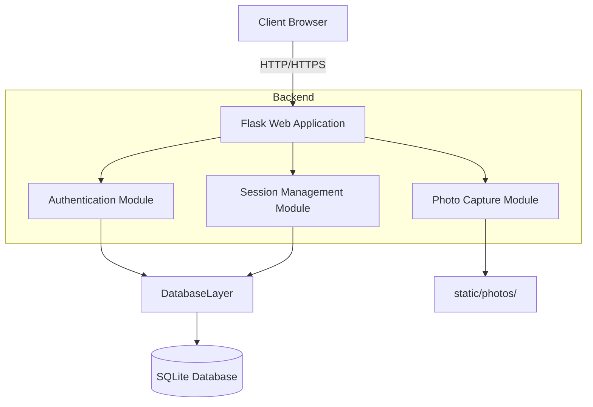

# Online Exam Monitoring & Integrity Analytics Platform - Milestone 1

This project represents the foundation of an Online Examination Monitoring System. It implements candidate registration, OpenCV-based webcam photo capture (for registration), login functionality, and basic session management using Flask and SQLite.

## System Architecture



## Database Schema (ER Diagram)

```mermaid
erDiagram
    Candidate {
        Integer id PK
        String full_name
        String email
        String password_hash
        String photo_path
        DateTime created_at
    }
    ExamSession {
        Integer id PK
        Integer candidate_id FK
        String session_token
        DateTime login_time
        DateTime logout_time
        String status
        DateTime created_at
    }
    AuthenticationLog {
        Integer id PK
        Integer candidate_id FK
        DateTime login_time
        DateTime logout_time
        String ip_address
        String user_agent
        String status
    }
    SessionLog {
        Integer id PK
        Integer session_id FK
        DateTime timestamp
        String event_type
        String description
    }
    
    Candidate ||--o{ ExamSession : \"starts\"
    Candidate ||--o{ AuthenticationLog : \"generates\"
    ExamSession ||--o{ SessionLog : \"contains\"
```

## Folder Structure

* `project/`
  * `app.py`: Main Flask application entry point.
  * `config.py`: Configuration settings.
  * `extensions.py`: Centralizes Flask extensions (SQLAlchemy, LoginManager).
  * `requirements.txt`: Python dependencies.
  * `instance/`: SQLite database storage.
  * `models/`: Database models for Candidate, Sessions, Logs.
  * `routes/`: Controllers (auth, dashboard, camera).
  * `templates/`: HTML Bootstrap templates.
  * `static/`: CSS, JS, and captured photos.
  * `utils/`: Faker generator and OpenCV camera utility.
  * `tests/`: Validation scripts.

## Installation Guide

1. Ensure Python 3.12 is installed.
2. Create and activate a virtual environment (optional but recommended).
   ```bash
   python -m venv venv
   # Windows:
   venv\\Scripts\\activate
   # macOS/Linux:
   source venv/bin/activate
   ```
3. Install dependencies:
   ```bash
   pip install -r requirements.txt
   ```

## Execution Steps

1. Run the application:
   ```bash
   python app.py
   ```
2. The system will automatically create `instance/database.db` and seed it with 100 fake candidates and 500 fake session logs.
3. Visit `http://127.0.0.1:5000` in your web browser.
4. Go to the \"Register\" page to create an account. Follow the camera capture prompt (A backend window will open on the server machine, press SPACE to capture, ESC to close).
5. Log in with your new credentials and view the Dashboard.
